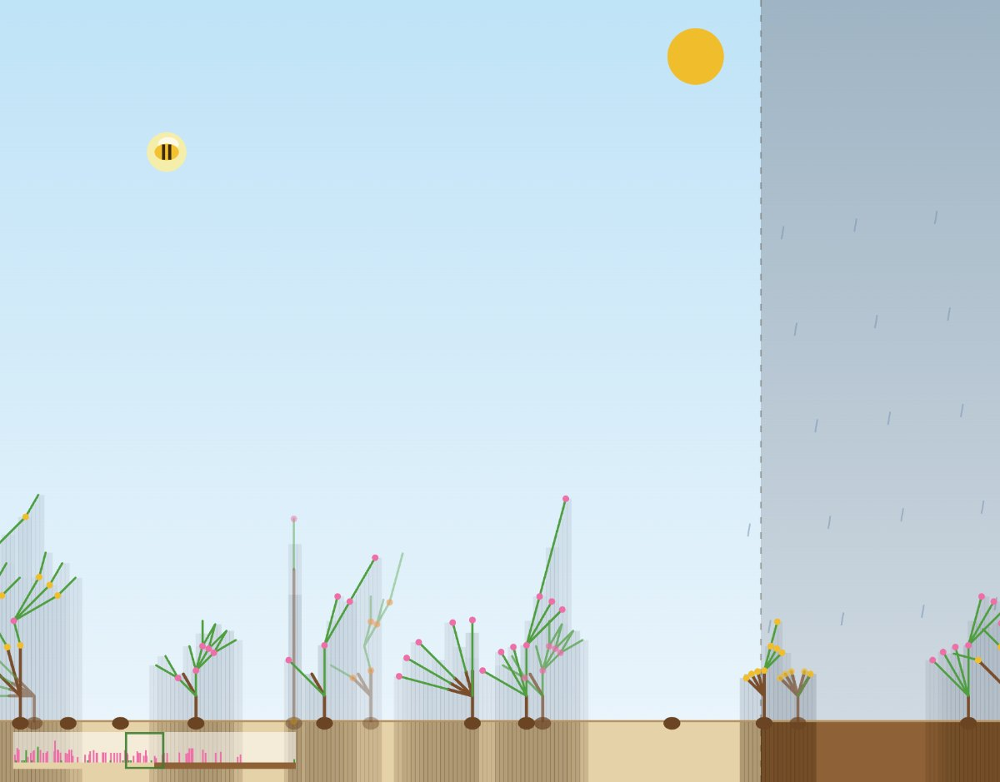

# Grammar Garden

A browser game for exploring evolution and genetics by growing plants from tiny recipes. Every
plant grows from a tiny recipe (an L-system), plants that can't hold themselves
up collapse, sunlight and soil water decide who thrives, and bees and
butterflies carry recipes between flowers to make the next generation. Over
time the field fills with whatever recipes happen to work, and nobody designed
them.

**Play it:** https://andyfooblah.github.io/grammar-garden/



*Tick 750 of a run with the default settings: the dry left half (10% rain) and the wet right half (80% rain), 64 different recipes alive, generation 16.*

The full game design, kept current with the code, is in [DESIGN.md](DESIGN.md).

## What you can do

- Watch a field of seeds grow when it rains and get pollinated when the sun is out.
- Click any plant to see its recipe, energy, water need, age and parents; edit
  the recipe and apply it, clone the plant, or write a new recipe and plant it.
- Open a plant's **family tree** four generations back, with every ancestor's
  recipe and fate.
- See **who is winning**: living plants grouped into families of similar
  recipes, with a size history for each.
- Watch the **kinds of plants** shift: every plant is sorted into grass, herb,
  bush, shrub or tree from its height, width and woodiness, and a stacked
  chart shows the mix over time.
- Tune the world: two climate zones with their own rain, soil that soaks and
  dries, sunlight strength, upkeep costs, mutation rate, bug counts and more.
- Pan and zoom around a wide field; save the whole garden to a JSON file and
  load it later. The game also autosaves in the browser.

## The recipe language

Every plant starts as the letter `A`. Each rainy tick, every capital letter is
replaced by its rule. Lower-case letters drive a pen:

| Symbol | Meaning |
|---|---|
| `f` / `b` | forward / backward one step, drawing a line |
| `l` / `r` | turn left / right |
| `+` / `-` | double / halve the step size |
| `[` / `]` | start a branch / return to where it started |
| `g` / `w` | green pen (leafy, catches light) / wood pen (strong, blocks light) |
| `y` / `p` | a yellow flower (bees) / a pink flower (butterflies) |

For example `A=wf[lB][rB]wfA;B=gf[lgf][rgf]p` is a woody trunk with pink
flowering side shoots. A plant collapses if its lines cross, if a green stem
carries too much, or if it grows into the ground.

## Develop

```bash
npm install
npm run dev      # local dev server
npm test         # unit tests (vitest)
npm run build    # typecheck + production build into dist/
```

No backend and no cloud services: the game is static files. Pushing to `main`
runs the tests and deploys to GitHub Pages through the workflow in
`.github/workflows/deploy.yml`.

## Layout

- `src/core/` — the simulation, framework-free and unit-tested: `grammar`
  (rules and growth), `turtle` (drawing), `structure` (collapse checks),
  `light` (sunlight and shade), `genetics` (crossover and mutation),
  `families` (grouping similar recipes), `world` (plants, bugs, climate, soil,
  save/load).
- `src/app/` — the browser app: `render` (canvas and camera), `audio`
  (synthesized sounds), `family` (the family tree overlay), `main` (UI wiring).
- `test/` — vitest suites for the core.

## License

Apache License 2.0, see [LICENSE](LICENSE).

## Credits

Built by Andrew Brook with help from Claude. The plant language is a small
L-system, in the tradition of Lindenmayer's work on modelling plant growth.
